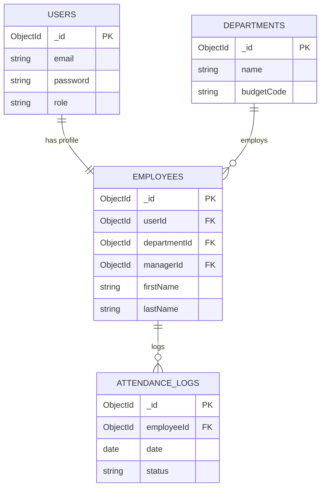
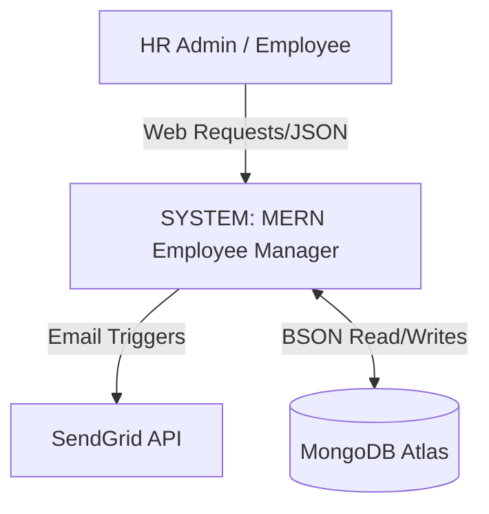

# Employee Management System (EMS)

A reliable, scalable, and modular MERN-stack Employee Management System featuring custom sequential Employee ID generation, Two-Step Authentication (2FA), and granular privilege-based role access control. Built with Domain-Driven Design (DDD) to ensure isolated business logic and easy cloud deployment.

## 🚀 Project Scope & Features

* **User Management:** Registration, login, and profile management.
* **Role-Based Access Control:** Dedicated Admin and User dashboards.
* **Core Workflows:** Complete business logic for employee management.
* **Data Handling:** Advanced search, filtering, and data management.
* **Validation:** Secure forms with robust user input validation.
* **Alerts:** Automated notifications and email integrations.
* **API:** Modular RESTful APIs.
* **UI/UX:** Responsive frontend adapting perfectly to desktop and mobile.
* **Analytics:** Basic reporting and aggregation dashboards.

## 📂 Project Architecture & Directory Layout

### Root Project Directory

The project uses a monorepo style with separate backend and frontend environments for independent scaling and cloud deployment.

```text
employee-management-system/
├── backend/                  # Node.js, Express, MongoDB REST API
├── frontend/                 # React.js (Vite), Bootstrap CSS
├── docker-compose.yml        # For local containerized testing & cloud deployment
├── .gitignore
└── README.md
```

### 1. Backend Structure (Node.js + Express + MongoDB)

The backend follows a strictly modular, feature-based MVP/Controller design pattern.

* **Model:** MongoDB Schemas (Data validation layer managed by Mongoose).
* **Presenter/Controller:** Dedicated route micro-logic, cryptographic operations, and server-side rules.
* **Routes:** Dispatches REST API network endpoints.

```text
backend/
├── src/
│   ├── config/                   # Global configs (db.js, cloud.js, mailer.js)
│   ├── middleware/               # Interceptors (auth, role, error, upload)
│   ├── modules/                  # 📦 INDIVIDUAL MODULES
│   │   ├── auth/                 # Login, Register, Session handling
│   │   ├── users/                # Profile & User Management
│   │   ├── employees/            # Core CRUD, Search, Filter logic
│   │   ├── notifications/        # Logic to trigger emails/in-app alerts
│   │   └── reports/              # Aggregation pipelines for dashboards
│   ├── utils/                    # Helpers (apiResponse.js, jwtToken.js)
│   ├── app.js                    # Express app initialization
│   └── server.js                 # Entry point, Server & DB startup
├── .env                          # Environment variables
└── package.json
```

### 2. Frontend Structure (React + Vite + Bootstrap)

The frontend maps directly to the backend domain modules. Every functional part of the application contains its own decoupled UI modules.

```text
frontend/
├── public/                       # Static assets
├── src/
│   ├── assets/                   # Images, SVGs, custom icons
│   ├── config/                   # API configs (axiosInstance.js)
│   ├── context/                  # Global State (AuthContext, ThemeContext)
│   ├── components/               # 🧩 SHARED UI COMPONENTS
│   │   ├── layout/               # Navbar, Sidebar, Footer, MainLayout
│   │   ├── form/                 # Reusable inputs, selects, errors
│   │   └── ui/                   # Modals, Badges, Loaders, Toasts, DataTables
│   ├── modules/                  # 📦 INDIVIDUAL FEATURE MODULES
│   │   ├── auth/                 # LoginForm, RegisterForm, auth.service.js
│   │   ├── dashboard/            # MetricCards, AdminDashboard, UserDashboard
│   │   ├── employees/            # EmployeeForm, SearchBar, FilterSidebar
│   │   └── profile/              # AvatarUpload, PasswordChange
│   ├── router/                   # Routing Logic (AppRoutes, PrivateRoute, AdminRoute)
│   ├── styles/                   # Custom Bootstrap overrides (custom-bootstrap.scss)
│   ├── App.jsx                   # Root component
│   └── main.jsx                  # Vite mount point
├── index.html
├── vite.config.js                # Vite config (proxy setup for backend)
└── package.json
```

## ☁️ Public Deployment & Implementation Structure

To make the application live, scalable, and secure, the decoupled architecture is deployed across specialized cloud services:

* **Frontend (React + Vite):** Deployed on Vercel or AWS Amplify for global CDN delivery and automated rebuilds on push.
* **Backend (Node.js + Express):** Deployed on AWS Elastic Beanstalk, Render, or DigitalOcean App Platform. Containerized using Docker for production parity and auto-scaling.
* **Database (MongoDB):** Hosted on MongoDB Atlas for automated backups, end-to-end encryption, and replica sets.
* **Asset Storage:** AWS S3 or Cloudinary handles avatars and PDFs, keeping the API stateless.
* **Security & DNS:** Cloudflare provides SSL/TLS encryption, DDoS protection, and WAF rules.

## 📋 Software Requirements Specification (SRS)

### Non-Functional Requirements

* **Performance:** API response time must be under 300ms for 95% of requests.
* **Scalability:** System must handle up to 500 concurrent authenticated users.
* **Availability:** 99.9% uptime SLA (via AWS auto-scaling and MongoDB Atlas replica sets).
* **Security:** bcrypt password hashing. All endpoints except `/api/auth/login` require JWT in an HTTP-Only cookie.

### Functional Requirements

* **Auth Module:** Locks out users after 5 failed login attempts for 15 minutes.
* **RBAC Module:** Admins can create/delete employees; Users can only view directories and edit their own profiles.
* **Employee Module:** Supports complex filtering (name, department, hire date).
* **Notifications:** Triggers an automated email via SendGrid when a new account is provisioned.

## 🗄️ Database Schema Design (ERD)



## 🔄 Data Flow Diagram (DFD)

### Level 0 (Context Diagram)



### Level 1 (Core Process Flow)

```mermaid
flowchart TD
    subgraph Auth ["1. Authentication Flow"]
        A1([User Submits Credentials]) --> A2[Auth Controller]
        A2 -->|Validates| A3[(Users DB)]
        A3 -->|Success| A4[Generates JWT]
        A4 --> A5([Sets HTTP-Only Cookie])
    end

    subgraph Management ["2. Employee Management Flow"]
        M1([Admin Submits Data]) --> M2[Employee Controller]
        M2 -->|Validates & Writes| M3[(Users & Employees DB)]
        M2 -->|Sends Event| M4[Notification Service]
        M4 --> M5([SendGrid Welcome Email])
    end

    subgraph Retrieval ["3. Data Retrieval Flow"]
        R1([User Requests Directory]) --> R2[Employee Controller]
        R2 -->|Queries .populate| R3[(Employees DB)]
        R3 --> R4[Controller Formats JSON]
        R4 --> R5([React Frontend UI Rendering])
    end
```


